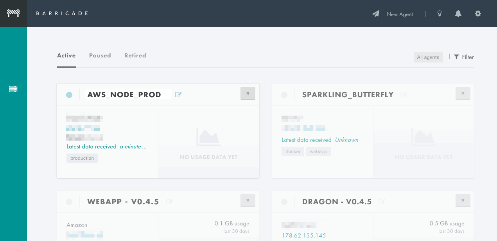

+++
title = "Stopping & Removing Agents"
description = "How to pause and retire Barricade Agents"
weight = "27"

tags = ["account", "close, "remove", "uninstall", "delete"]
section = "using-barricade"
categories = ["using-barricade"]
type = "page"
slug = "stopping-and-removing-agents"

[menu.main]
    url = "stopping-and-removing-agents"
    parent = "using-barricade"

+++

If you wish to stop monitoring a server, you can **pause** or **retire** the Agent via the [controls on this page](https://app.barricade.io/dashboard/agents):

Agents that are paused can be restarted later - whereas you cannot 'undo' a retired Agent through the web interface - a [reinstall](#installing-more-agents) would be required to restore the Agent.

## Pausing Agents

Older Agent versions do not support pausing and restarting. You should [update the Agent](#updating-agents) to the latest version.

## Retiring and Removing Agents

Retiring an Agent will stop the tranmission of data from your server, but it doesn't remove the Agent files. If you want to fully remove all traces of the Agent, you will need to manually do so by running a command on your server:

To remove from an Ubuntu server: `dpkg -r barricade`

To remove from a CentOS server: `rpm -e barricade`

## One-way Agents

Clicking 'pause' or retire' will prompt Barricade to signal a change in behavior to the Agent through the status API - it can't directly write to or alter the Agent directly ([by design](../getting-started/#how-it-works-agent)).

When the Agent communicates with the Barricade API it will check for any status changes in the API and respond accordingly.